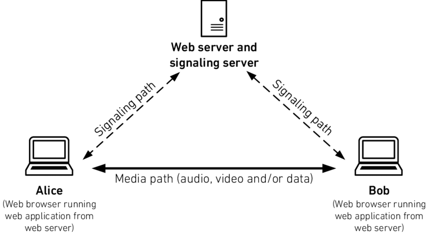

About:
========

This project is proof of concept to learn more about WebRTC this is one way create realtime audio and video stream no necessary any plugin or tools.

Talk about what's the project is one project where implement video chat where you have one room and another peoples can come in this room and see another peoples or screen shared per someone people in room.

The project features:
---------------------
- Mute or unmute mic
- Disable or enable video
- Room video chat can be more than 2 persons
- Share your screen com another persons in room.
- Record video with your audio and video
- Record video shared screen with audio

Instructions to running project locally:
========================================
- Clone project
- Execute command **npm install** to install modules used in project
- Execute command **npm run start:dev** to running application in address http://localhost:3000

Imagem explain how to work Webrtc:
===================================

